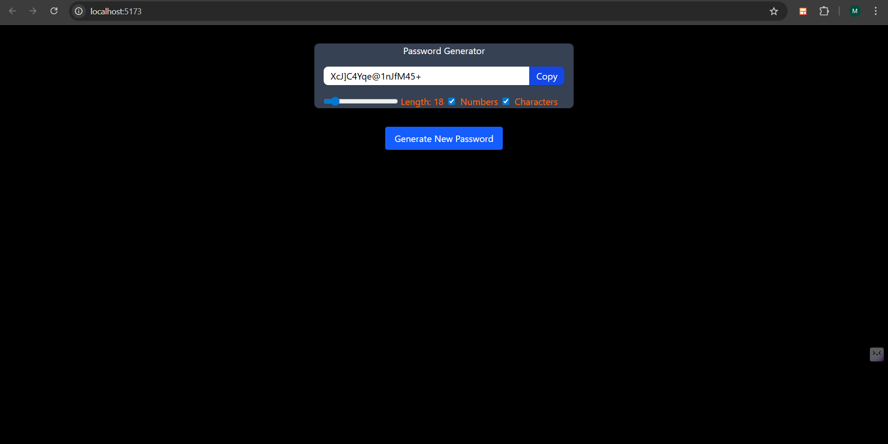

# 🔐 React Password Generator

A sleek and customizable *Password Generator App* built with *React, **Vite, **Tailwind CSS, and **JavaScript*. Easily generate strong, secure passwords based on your preferences.

---

## ✨ Features

- Set desired password *length*
- Include:
  - ✅ Uppercase letters
  - ✅ Lowercase letters
  - ✅ Numbers
  - ✅ Special characters
- One-click *copy to clipboard*
- Instant password regeneration
- Modern UI with responsive design (built using Tailwind CSS)
- Built using the *Vite + React* toolchain for lightning-fast development

---

## 🧪 Tech Stack

- ⚛️ *React* (Frontend)
- ⚡ *Vite* (Build tool)
- 🎨 *Tailwind CSS* (Styling)
- 🧠 *JavaScript* (Logic)
- 🧱 *HTML5*

---

## 📸 Preview

---
## 📦 Installation & Setup
# 1. Clone the repository
git clone https://github.com/Mardavweb/password-generator.git
cd password-generator-react

# 2. Install dependencies
npm install

# 3. Run the development server
npm run dev
